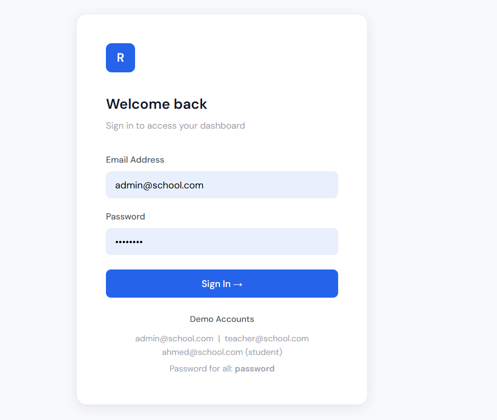
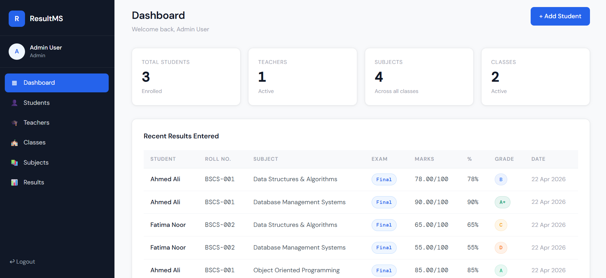
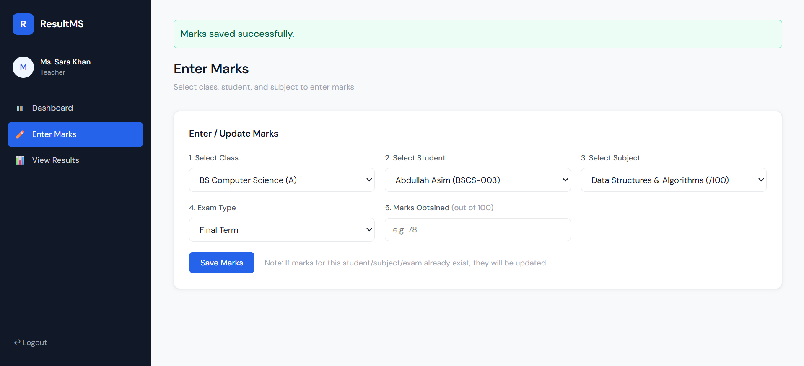
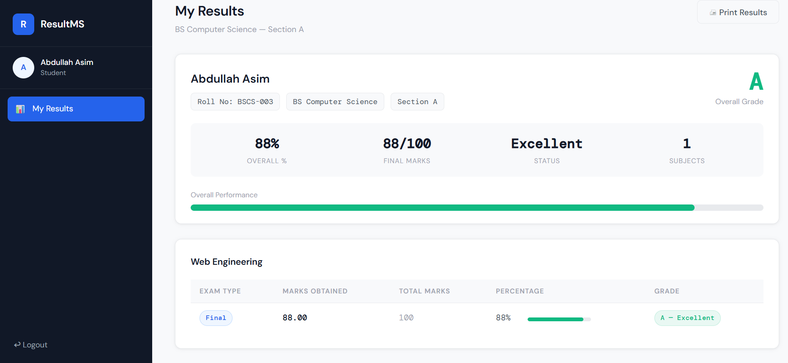

<<<<<<< HEAD
# Student-Result-Management-System
=======
# 📊 Student Result Management System

> A full-stack web application for managing student academic results, built with PHP and MySQL. Supports three roles: Admin, Teacher, and Student — each with their own dashboard and permissions.

---

## 📸 Screenshots

| Login Page | Admin Dashboard | Enter Marks | Student Results |
|---|---|---|---|
|  |  |  |  |

---

## ✨ Features

### 👤 Admin
- ✅ Manage students, teachers, classes, and subjects
- ✅ View all results with filters (by class, student, exam type)
- ✅ Add/delete users with secure password hashing
- ✅ Dashboard with system-wide statistics

### 🎓 Teacher
- ✅ Enter and update marks for any student/subject
- ✅ Dynamic class → student/subject loading (no page reload)
- ✅ View all results with filters
- ✅ Dashboard with personal stats

### 🎒 Student
- ✅ View own results grouped by subject
- ✅ Auto-calculated grades (A+, A, B, C, D, F)
- ✅ Visual progress bars per subject
- ✅ Overall GPA summary card
- ✅ Print-friendly result card

---

## 🛠️ Tech Stack

| Layer | Technology |
|-------|------------|
| Frontend | HTML5, CSS3, Vanilla JavaScript |
| Backend | PHP 8 |
| Database | MySQL (via phpMyAdmin) |
| Server | XAMPP (Apache + MySQL) |
| Fonts | DM Sans, DM Mono (Google Fonts) |

---

## 🗂️ Project Structure

```
student-result-system/
├── index.php                  ← Login page
├── logout.php
├── includes/
│   ├── db.php                 ← Database connection
│   ├── functions.php          ← Helper functions (grades, sanitize, etc.)
│   ├── header.php             ← Shared sidebar + nav
│   └── footer.php
├── admin/
│   ├── dashboard.php
│   ├── manage_students.php
│   ├── manage_teachers.php
│   ├── manage_classes.php
│   ├── manage_subjects.php
│   └── all_results.php
├── teacher/
│   ├── dashboard.php
│   ├── enter_marks.php        ← Dynamic AJAX subject/student loading
│   └── view_results.php
├── student/
│   └── dashboard.php          ← Personal result card with print support
├── assets/
│   ├── css/style.css
│   └── js/main.js
└── database/
    └── result_system.sql      ← Import this to set up the database
```

---

## ⚙️ Setup & Installation

### Requirements
- XAMPP (or any Apache + PHP 8 + MySQL stack)
- Browser (Chrome / Firefox)

### Steps

1. **Clone the repository**
   ```bash
   git clone https://github.com/YOUR_USERNAME/student-result-system.git
   ```

2. **Move to XAMPP's web folder**
   ```
   Copy the folder to: C:/xampp/htdocs/student-result-system
   ```

3. **Start XAMPP**
   - Open XAMPP Control Panel
   - Start **Apache** and **MySQL**

4. **Import the database**
   - Open `http://localhost/phpmyadmin`
   - Click **Import** → Choose `database/result_system.sql` → Click **Go**

5. **Open the app**
   ```
   http://localhost/student-result-system/
   ```

---

## 🔐 Demo Login Credentials

| Role | Email | Password |
|------|-------|----------|
| Admin | admin@school.com | password |
| Teacher | teacher@school.com | password |
| Student | ahmed@school.com | password |
| Student | fatima@school.com | password |

> ⚠️ Change these credentials after your first login via the admin panel.

---

## 🔒 Security Features

- Passwords stored using `password_hash()` (bcrypt) — never plain text
- All inputs sanitized with `htmlspecialchars()` and `strip_tags()`
- Role-based access control — each role can only access its own pages
- Prepared statements used for all database queries (SQL injection prevention)
- Session-based authentication with server-side validation

---

## 🙋‍♀️ Author

**Khadija Ayub**
- GitHub: [@Khadija-Ayub](https://github.com/Khadija-Ayub)
- Email: khadijaayub19@gmail.com

---

## 📄 License

This project is open source and available under the [MIT License](LICENSE).
>>>>>>> 2fa10f1 (Initial commit - Student Result Management System)
